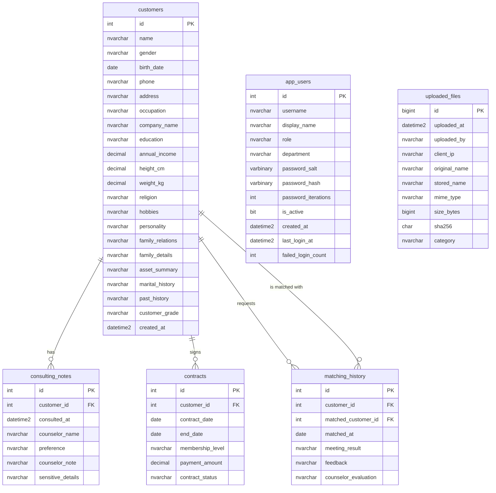

# Marriage CRM DB 명세서

## 1. 개요

| 항목 | 내용 |
| --- | --- |
| 시스템 | A사 상담 CRM |
| DB 이름 | `MarriageCrm` |
| DBMS | Microsoft SQL Server 2022 |
| DB 서버 | VM8 Ubuntu 22.04, `10.10.30.30:1433` |
| 연결 애플리케이션 | VM5 IIS CRM, `10.10.30.20` |
| 문자 데이터 타입 | 한글 지원을 위해 `nvarchar` 사용 |
| 데이터 성격 | 침해사고 분석 실습용 가상 민감 개인정보 |

모든 고객 데이터는 실습용 가상 데이터입니다. 실제 사람의 개인정보를 사용하지 않습니다.

## 2. ERD

## 3. 테이블 목록

| 테이블 | 목적 | 기준 건수 |
| --- | --- | ---: |
| `dbo.customers` | 고객 기본정보, 성별, 회사, 소득, 신체조건, 종교, 성향, 가족, 자산, 과거 이력, 내부등급 저장 | 500 |
| `dbo.consulting_notes` | 상담 기록, 배우자 선호 조건, 민감 상담 메모 저장 | 500 이상 |
| `dbo.contracts` | CRM 계약 정보 저장 | 500 |
| `dbo.matching_history` | 회원 간 매칭 결과와 상담사 평가 저장 | 500 이상 |
| `dbo.uploaded_files` | CRM 첨부파일 업로드 감사 이력 저장 | 최초 0 |
| `dbo.app_users` | 상담사, 선임 상담사, 부장, 관리자 로그인 계정, 역할, 로그인 이력 저장 | 18 |

## 4. 컬럼 명세

### 4.1 `dbo.customers`

| 컬럼 | 타입 | NULL | 키 | 설명 |
| --- | --- | --- | --- | --- |
| `id` | `int IDENTITY(1,1)` | N | PK | 고객번호 |
| `name` | `nvarchar(80)` | N |  | 고객명 |
| `gender` | `nvarchar(10)` | N |  | 성별, `남성`, `여성`, `비공개` |
| `birth_date` | `date` | N |  | 생년월일 |
| `phone` | `nvarchar(30)` | N |  | 연락처 |
| `address` | `nvarchar(255)` | N |  | 주소 |
| `occupation` | `nvarchar(100)` | N |  | 직업 |
| `company_name` | `nvarchar(120)` | N |  | 재직 회사명 |
| `education` | `nvarchar(100)` | N |  | 최종 학력 |
| `annual_income` | `decimal(18,0)` | N |  | 연 소득, 0 이상 |
| `height_cm` | `decimal(5,1)` | N |  | 키, cm 단위 |
| `weight_kg` | `decimal(5,1)` | N |  | 몸무게, kg 단위 |
| `religion` | `nvarchar(60)` | N |  | 종교 |
| `hobbies` | `nvarchar(255)` | N |  | 취미 |
| `personality` | `nvarchar(255)` | N |  | 성격 및 상담 성향 요약 |
| `family_relations` | `nvarchar(255)` | N |  | 가족관계 요약 |
| `family_details` | `nvarchar(500)` | N |  | 가족 상황, 부양, 상견례, 가족 이슈 등 민감 메모 |
| `asset_summary` | `nvarchar(500)` | N |  | 부동산, 예금, 투자, 대출 등 자산 요약 |
| `marital_history` | `nvarchar(255)` | N |  | 결혼·파혼·재혼 관련 이력 |
| `past_history` | `nvarchar(500)` | N |  | 과거 교제, 이직, 유학, 건강 상담 등 민감 이력 |
| `customer_grade` | `nvarchar(10)` | N |  | 내부 고객등급, `S`, `A`, `B` |
| `created_at` | `datetime2(0)` | N |  | 등록 시각, UTC 기본값 |

### 4.2 `dbo.consulting_notes`

| 컬럼 | 타입 | NULL | 키 | 설명 |
| --- | --- | --- | --- | --- |
| `id` | `int IDENTITY(1,1)` | N | PK | 상담 기록 번호 |
| `customer_id` | `int` | N | FK | `customers.id` |
| `consulted_at` | `datetime2(0)` | N |  | 상담 일시 |
| `counselor_name` | `nvarchar(80)` | N |  | 상담사명 |
| `preference` | `nvarchar(500)` | N |  | 배우자 선호 조건 |
| `counselor_note` | `nvarchar(1000)` | N |  | 상담사 업무 메모 |
| `sensitive_details` | `nvarchar(1000)` | N |  | 상담 중 언급된 민감정보 |

### 4.3 `dbo.contracts`

| 컬럼 | 타입 | NULL | 키 | 설명 |
| --- | --- | --- | --- | --- |
| `id` | `int IDENTITY(1,1)` | N | PK | 계약번호 |
| `customer_id` | `int` | N | FK | `customers.id` |
| `contract_date` | `date` | N |  | 계약 시작일 |
| `end_date` | `date` | Y |  | 계약 종료일 |
| `membership_level` | `nvarchar(40)` | N |  | `STANDARD`, `PREMIUM` |
| `payment_amount` | `decimal(18,0)` | N |  | 결제 금액 |
| `contract_status` | `nvarchar(30)` | N |  | `ACTIVE`, `EXPIRED`, `CANCELLED` |

### 4.4 `dbo.matching_history`

| 컬럼 | 타입 | NULL | 키 | 설명 |
| --- | --- | --- | --- | --- |
| `id` | `int IDENTITY(1,1)` | N | PK | 매칭 이력 번호 |
| `customer_id` | `int` | N | FK | 기준 고객, `customers.id` |
| `matched_customer_id` | `int` | N | FK | 매칭 상대, `customers.id` |
| `matched_at` | `date` | N |  | 매칭 일자 |
| `meeting_result` | `nvarchar(100)` | N |  | 만남 결과 |
| `feedback` | `nvarchar(1000)` | N |  | 고객 피드백 |
| `counselor_evaluation` | `nvarchar(1000)` | N |  | 상담사 평가 |

### 4.5 `dbo.uploaded_files`

| 컬럼 | 타입 | NULL | 키 | 설명 |
| --- | --- | --- | --- | --- |
| `id` | `bigint IDENTITY(1,1)` | N | PK | 업로드 기록 번호 |
| `uploaded_at` | `datetime2(0)` | N |  | 업로드 시각 |
| `uploaded_by` | `nvarchar(100)` | N |  | CRM 로그인 사용자 |
| `client_ip` | `nvarchar(64)` | N |  | 접속 IP |
| `original_name` | `nvarchar(260)` | N |  | 원본 파일명 |
| `stored_name` | `nvarchar(260)` | N |  | 서버 저장 파일명 |
| `mime_type` | `nvarchar(200)` | N |  | 브라우저가 전달한 MIME |
| `size_bytes` | `bigint` | N |  | 파일 크기 |
| `sha256` | `char(64)` | N |  | SHA-256 해시 |
| `category` | `nvarchar(40)` | N |  | `CUSTOMER_DOCUMENT`, `CONSULTING_MATERIAL`, `CONTRACT` |

### 4.6 `dbo.app_users`

| 컬럼 | 타입 | NULL | 키 | 설명 |
| --- | --- | --- | --- | --- |
| `id` | `int IDENTITY(1,1)` | N | PK | 계정 번호 |
| `username` | `nvarchar(80)` | N | UQ | 로그인 아이디 |
| `display_name` | `nvarchar(80)` | N |  | 화면 표시 이름 |
| `role` | `nvarchar(30)` | N |  | `Counselor`, `SeniorCounselor`, `Manager`, `Admin` |
| `department` | `nvarchar(80)` | N |  | 소속 부서 |
| `password_salt` | `varbinary(16)` | N |  | PBKDF2 salt |
| `password_hash` | `varbinary(32)` | N |  | PBKDF2-SHA256 결과 |
| `password_iterations` | `int` | N |  | 반복 횟수, 기본 100000 |
| `is_active` | `bit` | N |  | 계정 활성 여부 |
| `created_at` | `datetime2(0)` | N |  | 계정 생성 시각 |
| `last_login_at` | `datetime2(0)` | Y |  | 최근 로그인 성공 시각 |
| `last_failed_login_at` | `datetime2(0)` | Y |  | 최근 로그인 실패 시각 |
| `failed_login_count` | `int` | N |  | 누적 또는 최근 실패 횟수 |
| `password_changed_at` | `datetime2(0)` | N |  | 비밀번호 변경 시각 |

## 5. 제약조건

| 제약조건 | 대상 | 내용 |
| --- | --- | --- |
| `CK_customers_customer_grade` | `customers.customer_grade` | `S`, `A`, `B`만 허용 |
| `CK_customers_gender` | `customers.gender` | `남성`, `여성`, `비공개`만 허용 |
| `CK_customers_height_cm` | `customers.height_cm` | 130.0부터 220.0까지 허용 |
| `CK_customers_weight_kg` | `customers.weight_kg` | 35.0부터 160.0까지 허용 |
| `CK_contracts_membership_level` | `contracts.membership_level` | `STANDARD`, `PREMIUM`만 허용 |
| `CK_contracts_contract_status` | `contracts.contract_status` | `ACTIVE`, `EXPIRED`, `CANCELLED`만 허용 |
| `CK_matching_history_distinct_customer` | `matching_history` | 기준 고객과 매칭 상대 동일 금지 |
| `CK_uploaded_files_category` | `uploaded_files.category` | 허용된 업로드 분류만 저장 |
| `CK_app_users_role` | `app_users.role` | `Counselor`, `SeniorCounselor`, `Manager`, `Admin`만 허용 |
| `CK_app_users_password_iterations` | `app_users.password_iterations` | 100000 이상 |

## 6. 인덱스 명세

| 인덱스 | 테이블 | 컬럼 | 목적 |
| --- | --- | --- | --- |
| `IX_consulting_notes_customer_id` | `consulting_notes` | `customer_id` | 고객 상세 상담 이력 조회 |
| `IX_contracts_customer_id` | `contracts` | `customer_id` | 고객별 계약 조회 |
| `IX_matching_history_customer_id` | `matching_history` | `customer_id` | 고객별 매칭 이력 조회 |
| `IX_uploaded_files_uploaded_at` | `uploaded_files` | `uploaded_at DESC` | 최근 업로드 목록 조회 |
| `IX_app_users_role` | `app_users` | `role` | 관리자 계정 현황 조회 |

## 7. 계정과 권한

| 계정 | 용도 | 권한 |
| --- | --- | --- |
| `sa` | 최초 구축, 감사 정책 설정, 장애 대응 | 관리자 전용, CRM에서 사용 금지 |
| `crm_app` | VM5 CRM 애플리케이션 | `dbo` 스키마 `SELECT`, `customers` 테이블 `INSERT`/`UPDATE`, `uploaded_files` 테이블 `INSERT`, `app_users` 로그인 이력 `UPDATE` |

`crm_app`에는 테이블 생성, 삭제, 로그인 생성 권한을 부여하지 않습니다. 고객 추가/수정 업무를 위해 `customers` 테이블에 한정하여 `INSERT`와 `UPDATE`를 허용합니다. 회사 계정은 `app_users` 테이블에서 관리하며 비밀번호는 평문이 아닌 PBKDF2-SHA256 해시로 저장합니다.

## 8. 데이터 생성 기준

| 데이터 | 기준 |
| --- | --- |
| 고객 수 | `init.sql` 또는 `migration-sensitive-500.sql` 실행 후 최소 500명 |
| 내부등급 | 소득, 직업 안정성, 자산 요약을 가정한 `S`, `A`, `B` 분류 |
| 민감정보 | 성별, 회사, 연봉, 주소, 신체조건, 종교, 취미, 성격, 가족 상세, 자산, 과거 이력 |
| 상담 기록 | 고객별 최소 1건 이상 |
| 계약 정보 | 고객별 최소 1건 이상 |
| 매칭 이력 | 고객별 최소 1건 이상 |
| 회사 계정 | 상담사 10명, 관리자 1명 |

## 9. CRM CSV 매핑

| CRM 다운로드 파일 | 원본 테이블 | 포함 정보 |
| --- | --- | --- |
| `customer_dump.csv` | `customers` | 고객 기본정보와 민감 프로필 전체 |
| `consulting_notes_dump.csv` | `consulting_notes` + `customers` | 상담 조건, 메모, 민감 상담 내용 |
| `contracts_dump.csv` | `contracts` + `customers` | 계약 기간, 회원 등급, 결제 금액, 상태 |
| `matching_history_dump.csv` | `matching_history` + `customers` | 매칭 상대, 만남 결과, 피드백, 상담사 평가 |

고객 상세 페이지에서는 고객별 Word 문서를 내려받을 수 있습니다. 자료 추출 페이지에서 고객명을 검색하면 검색 결과 고객들의 Word 문서를 ZIP으로 내려받을 수 있습니다. 항목별 CSV 다운로드는 각 테이블 기준으로 제공됩니다.

## 10. 감사 정책

[`audit.sql`](audit.sql)은 SQL Server Audit를 다음과 같이 설정합니다.

| 감사 대상 | 분석 포인트 |
| --- | --- |
| 로그인 성공·실패 | CRM 서버 접속, 비정상 인증 시도 |
| 로그아웃 | 세션 종료 |
| `dbo` 스키마 `SELECT` | 고객정보 반복 조회와 대량 조회 |
| `INSERT`, `UPDATE`, `DELETE` | 첨부 기록 및 비정상 데이터 변경 |

감사 로그는 `/var/opt/mssql/audit/*.sqlaudit`에 저장되며 [`audit-report.sql`](audit-report.sql)로 확인합니다.
